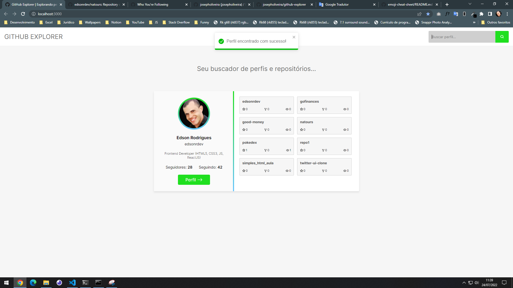
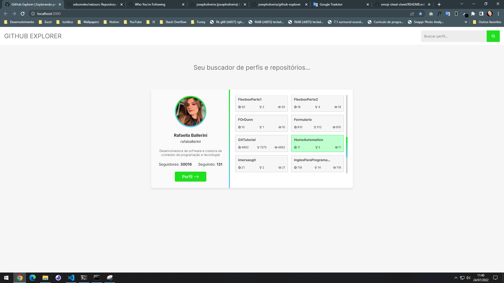
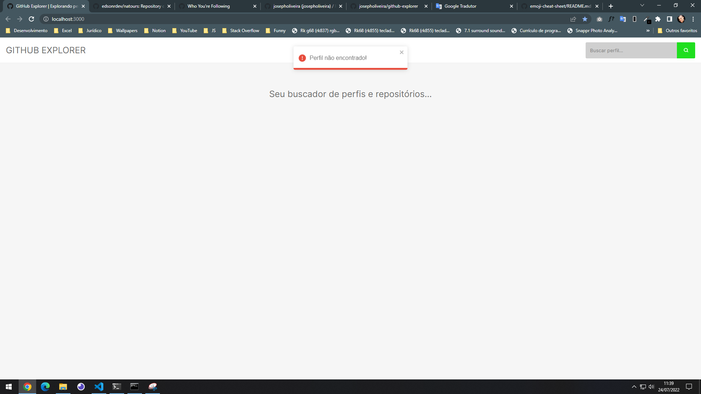

# GitHub Explorer | Exploring GitHub profiles

“Your profile and repositories finder...”</blockquote>

  

  

## 🚀 About the project

GitHub Explorer is a web application that allows the user to explore/search basic information about GitHub profiles and repositories.

Through a form, the user informs the name of the profile and sends a request to the GitHub API, which returns this data to our front-end React.

It is a simple application, but developed using important React concepts (states, props and components) and used Styled-Components for visual styling.

I hope you enjoy using it as much as I enjoyed implementing it.

## Preview of application

<video width="100%" controls>
  <source src=".github-explorer.mp4" type="video/mp4">
  Your browser does not support the video tag.
</video>

## Install

First of all, you need to clone this repository, run the command `git clone https://github.com/edsonrdev/github-explorer.git`.

After that enter the newly created folder, with the command: `cd github-explorer`.

Then run the command `yarn` or `npm install`, to download all dependencies.

After the dependencies download is complete, run the application with `yarn start` or `npm start`.

Enjoy! 😊

## 📝 License

This project is under the MIT license. See the [LICENSE](LICENSE.md) file for more details.

---

Made with ❤️ by <a href='https://github.com/edsonrdev'>Edson Rodrigues</a> 👋
